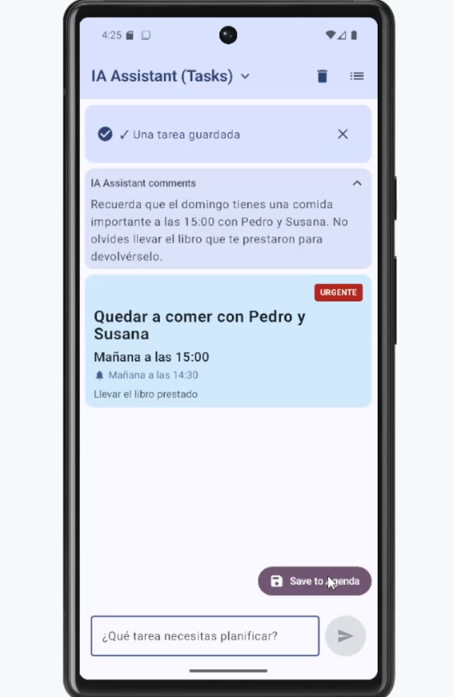
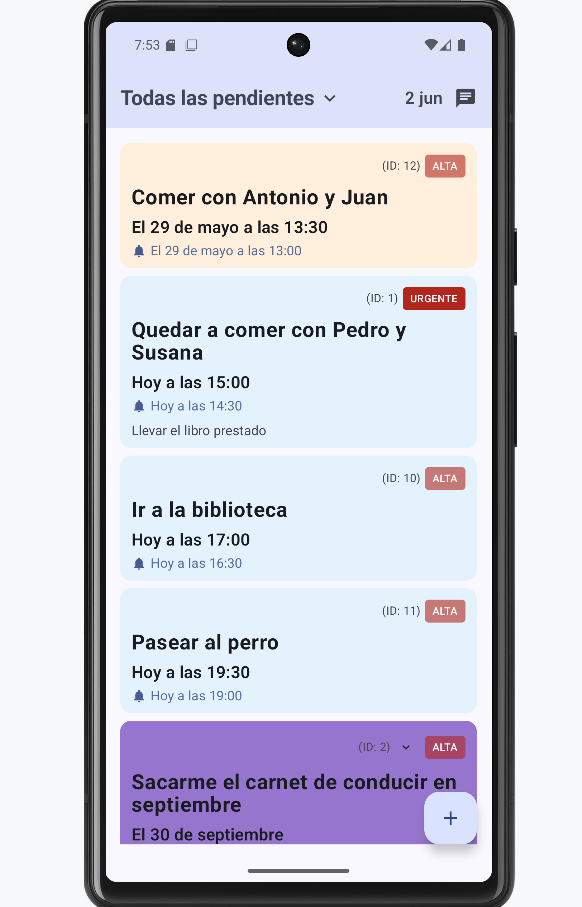

# ProcrastinApp — Agenda Inteligente contra la Procrastinación 🧠📅

Una aplicación de agenda en lenguaje natural para Android que integra inteligencia artificial con el objetivo de combatir la procrastinación. El usuario puede dialogar con un asistente virtual para generar, organizar y registrar tareas, aprobándolas antes de que se integren en su lista de pendientes.

## ✨ Características principales

- 🗣️ **Interfaz en lenguaje natural**: habla con la IA para generar tareas
- ✅ **Aprobación previa**: las tareas sugeridas solo se guardan si el usuario las aprueba
- 📅 **Gestión de tareas recurrentes y prioritarias**
- 🧩 **Arquitectura MVVM con Clean Architecture**
- 💾 **Persistencia local con Room Database**
- 🤖 **Integración con OpenAI GPT para procesamiento inteligente**

## 🧱 Tecnologías utilizadas

- **Lenguaje**: Kotlin
- **Framework UI**: Jetpack Compose
- **Arquitectura**: MVVM + Clean Architecture
- **Persistencia**: Room (SQLite)
- **Red / IA**: Retrofit + OpenAI GPT API
- **Inyección de dependencias**: Koin
- **Testing**: JUnit, Mockito, MockK, Robolectric
- **Build System**: Gradle (Kotlin DSL)

## 📷 Capturas de pantalla

 

## 🚀 Instalación y ejecución

### Prerrequisitos
- Android Studio Hedgehog (2023.1.1) o superior
- JDK 11 o superior
- Dispositivo/emulador con API 26+ (Android 8.0)
- Clave API de OpenAI

### Configuración

1. **Clona este repositorio**:
   ```bash
   git clone https://github.com/ibuendiac/ProcrastinApp.git
   cd ProcrastinApp
   ```

2. **Configura la API de OpenAI**:
   - Crea un archivo `local.properties` en la raíz del proyecto
   - Añade tu clave API:
   ```properties
   OPENAI_API_KEY=tu_clave_api_aqui
   ```

3. **Abre el proyecto** en Android Studio

4. **Sincroniza** las dependencias (Gradle Sync)

5. **Ejecuta la aplicación** desde `MainActivity.kt`

## 📁 Estructura del proyecto

```
app/src/main/java/com/ibc/procrastinapp/
├── data/               # Capa de datos
│   ├── ai/             # OpenAI: Implementación infraestructura
│   ├── local/          # Room: DAOs, entidades, base de datos
│   ├── mapper/         # Adaptador Room-Repository
│   ├── model/          # Task: core modelo datos
│   ├── repository/     # Implementaciones de repositorios
│   └── service/        # Servicios sobre API de OpenAI
├── ui/                 # Capa de presentación (Compose)
│   ├── assistant/      # Pantalla asistente IA (V+VM)
│   ├── navigation/     # Navegación
│   ├── splash/         # Pantalla inicial
│   ├── tasklist/       # Pantalla lista tareas (V+VM)
│   └── theme/          # Tema y estilos
└── utils/              # Utilidades comunes
```

## 🧪 Testing

### Pruebas unitarias
Ubicación: `app/src/test/java/`
```bash
./gradlew test
```

### Pruebas de integración
Ubicación: `app/src/androidTest/java/`
```bash
./gradlew connectedAndroidTest
```

**Archivos de prueba principales**:
- `TaskRepositoryIntegrationTest.kt` - Pruebas del repositorio
- Tests de ViewModels y casos de uso
- Tests de la base de datos Room

## 🧪 Ejemplo de interacción

Consulta un [ejemplo de prompt y resultado en formato JSON](./README-ejemplo-interaccion.txt) generado por la IA.

## 🧠 Filosofía

La procrastinación no se vence solo con listas: se necesita motivación, claridad y un enfoque humano. Esta app apuesta por integrar IA en el flujo de creación de tareas para que no te sientas abrumado, sino acompañado.

## 📌 Estado actual

✅ **Completado**:
- Funcionalidad base implementada
- Integración con OpenAI GPT
- Persistencia local con Room
- Arquitectura MVVM
- Testing unitario e integración

🚧 **En desarrollo**:
- Notificaciones push
- Mejoras en la UI/UX

🔜 **Futuras mejoras**:
- Sincronización en la nube
- Análisis de patrones de procrastinación
- Gamificación

## 🔲 Tareas pendientes

- 📌 **Notificaciones y fechas límite** (recordatorios, deadlines)
- 🔎 **Filtros visuales** y dashboard motivacional
- 🧠 **Frases inspiradoras** generadas por IA
- 📊 **Estadísticas** de productividad
- 🎨 **Mejoras visuales** en la interfaz

## 📄 Licencia

Este proyecto está licenciado bajo la Licencia MIT. Ver el archivo [LICENSE](LICENSE) para más detalles.

## 🙏 Recursos de terceros

Ver [THIRD-PARTY-NOTICES.md](THIRD-PARTY-NOTICES.md) para información detallada sobre las librerías y recursos utilizados.

## 📞 Contacto

¿Preguntas o sugerencias? 
- GitHub: [@ibuendiac](https://github.com/ibuendiac)
- Proyecto: [ProcrastinApp](https://github.com/ibuendiac/ProcrastinApp)

---

Hecha con ❤️ para quienes luchan por aprovechar mejor su tiempo